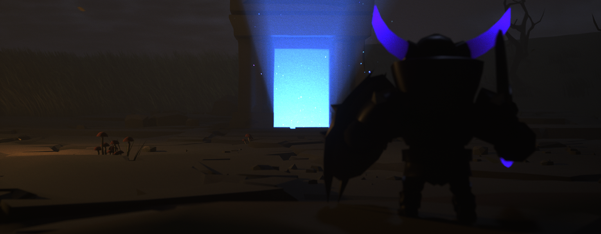

# Dungeon Realms

<figure><figcaption></figcaption></figure>

In a realm caught in an endless battle between forces of darkness and the ever-dwindling light, heroes emerge from the shadows, drawn to the heart of ancient dungeons that pulse with untold power. These dungeons, forgotten by time and sealed by ancient magics, are not only battlegrounds but also sanctuaries where heroes hone their skills and wield the scarce resource of light—a force that fuels their strength and grants them dominion over their domains.

The Landlords, those who rise above the masses, are the masters of these realms. As they conquer the depths of dungeons, they awaken dormant forces and uncover relics that grant unimaginable power. In these darkened chambers, heroes engage in brutal combat against monstrous foes, test their mettle in fierce PvP confrontations, and gather rare resources to further strengthen their grasp on the ever-scarce light. With every victory, the balance between chaos and the remaining flickers of light shifts, changing the very fabric of their world.

As dungeons evolve and heroes grow, the tension between light and darkness becomes ever more pronounced. The scarce light, tied to both the realms and the heroes themselves, is coveted by all who seek dominance. The quest for power never ends, as the Landlords strive to harness it, shape it, and use it to bend the world to their will. In this perpetual cycle of conquest, every dungeon conquered, and every hero raised, inches the world closer to either ultimate redemption or total descent into chaos. The saga unfolds in an endless war, where the future of the Dungeon Realms lies in the hands of those who dare to challenge its darkness.

